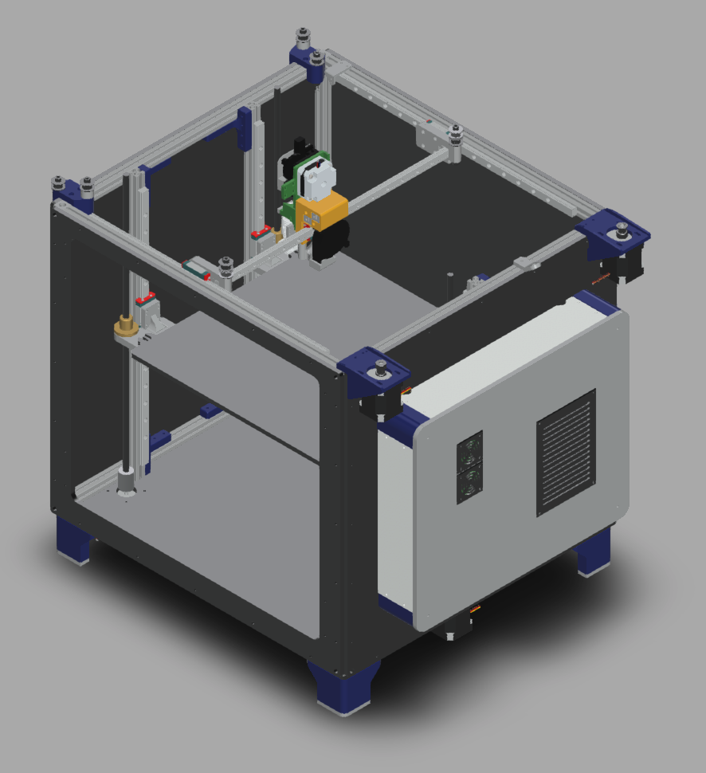

Railcore II 300ZL/ZLT
=======

RailCore® II is a Core-XY based Reprap 3D printer designed by J. Steve White & Tony Akens under the CC-Attribution Only license.

## Top-Level Specs
* CoreXY Motion System
* 300x300x300mm (ZL) or 300x300x600mm (ZLT) build volume.
* kinematically coupled bed plate (optionally)
* autotramming with 3-point bed-leveling
* ~$1700 for a single unit, including hotend. See the [BOM][bom] for the part breakdown
* User Extensible! We encourage extending the design to custom applications via custom tools and bed plates
* Full specs listed on [this page](https://railcore.org)

## Build your own Railcore

The best way to get started is to thumb through the [**Assembly Instructions**](https://railcore.dozuki.com/c/RailCore_II) and [**Bill of Materials**][bom] first. Then, your options are to self-source using the [BOM][bom], or purchase a kit. Kit options:

* https://www.filastruder.com/collections/railcore (US-Based, kits are comprised of exactly the parts on the [BOM][bom])
* https://hightemp3d.com (EU-Based, kits may not be comprised of the parts on the [BOM][bom])

## Repository Contents

* **DXF** - DXF files for the RailCore II 300ZL & ZLT, typically for sheet cutting. Materials that can be used are in a text materials.md file for viewing.
* **STEP**  - STEP files for the RailCore II 300ZL & ZLT. All printed parts, milled and cut parts.
* **STL**  - contains STL all the parts that need to be printed to produce a Railcore. Some, like Z-Brackets and Z-Yokes, are available in aluminum. See [BOM][bom].
* **auxillary**  - List of auxillary, untested or outdated parts for the RailCore II
  * **font** - contains the font used for the Railcore II 300ZL/ZLT engraving on the panels.
  * **jigs** - contains parts that can be used for alignment or assembly.
  * **print_tests** - contains parts that can be used for testing/tuning a Railcore
  * **outdated parts** - contains parts that are no longer used.
* **upgrade_or_crossgrade_parts** - for official parts that aren't necessary for a base RailCore functionality. (doors or STL's for commercial parts authorised by RailCore Labs)
* **wiring** - contains details on all the custom wiring that is used in a Railcore in WireViz format.

The halo and Y-plate are optional, the motor mount and idler mounts are recommended to be made from aluminum, but machined and finished versions are available, see [BOM][bom].
More printed parts are available at the [RailCore Thingiverse collection](https://www.thingiverse.com/railcore/collections/300zl-zlt)

## Support

Have questions? Building your own Railcore? **[Join the Discord!][discord]**
Lots more information available [here](https://railcore.org)

## Contributing

Railcore is meant to be extended by the community. If you are interested in contributing, there are a number of ways to get involved:

* Review, comment, or add to the **[open issues](https://github.com/railcore/parts/issues)**
* **[Join the Discord!][discord]**

### Open Source
The name Railcore is a registered trademark of RailCore Labs, LLC. All Rights reserved.
Railcore is licensed under a [Creative Commons Attribution-ShareAlike 3.0 Unported License][cc-by] (CC BY-SA 3.0).
[![CC BY 3.0][cc-by-image]][cc-by]
You can modify / distribute these files, and as long as you attribute to RailCore Labs e.g. "Original design by RailCore Labs"

[bom]: https://docs.google.com/spreadsheets/d/1sxKl6h23SXfuNM7hNiX35rIrpISw8AruEEcNl2Fvibk/edit?usp=sharing
[cc-by]: https://creativecommons.org/licenses/by-sa/3.0/
[cc-by-image]: https://i.creativecommons.org/l/by-sa/3.0/88x31.png
[discord]: https://discord.gg/Sy569Hq
[wiki]: https://railcore.org
